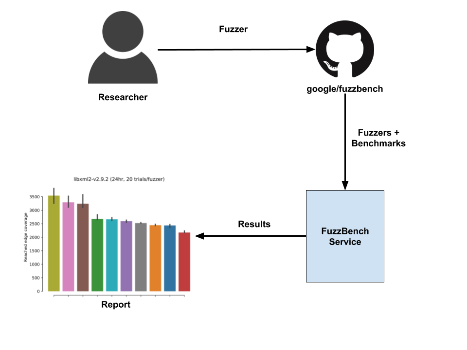

# Request for AFLChurn jobs
## Successful integration of regressed bugs for AFLChurn
If you want to add new fuzz targets, remove `--depth 1` in Dockerfile of the new target projects.

Regressed:

- [openssl_client](https://bugs.chromium.org/p/oss-fuzz/issues/detail?id=20816&q=openssl&can=1&start=200)
- openssl_x509 [1](https://bugs.chromium.org/p/oss-fuzz/issues/detail?id=17715), [2](https://bugs.chromium.org/p/oss-fuzz/issues/detail?id=17722)
- [jsoncpp_jsoncpp_fuzzer](https://bugs.chromium.org/p/oss-fuzz/issues/detail?id=21916&sort=proj%20-id%20reported&q=status%3DVerified%20type%3DBug-Security&can=1&start=2100)
- [libgit2_patch_parse_fuzzer](https://bugs.chromium.org/p/oss-fuzz/issues/detail?id=18882&sort=proj%20-id%20reported&q=status%3DVerified%20type%3DBug-Security&can=1&start=2300)
- [libgit2_objects_fuzzer](https://bugs.chromium.org/p/oss-fuzz/issues/detail?id=11382&sort=proj%20-id%20reported&q=status%3DVerified%20type%3DBug-Security&can=1&start=2300)
- [libhtp_fuzz_htp](https://bugs.chromium.org/p/oss-fuzz/issues/detail?id=17198&sort=proj%20-id%20reported&q=status%3DVerified%20type%3DBug-Security&can=1&start=2300)
- [libsass_data_context_fuzzer](https://bugs.chromium.org/p/oss-fuzz/issues/detail?id=15893&sort=proj%20-id%20reported&q=status%3DVerified%20type%3DBug-Security&can=1&start=2700)
- [oniguruma_fuzzer](https://bugs.chromium.org/p/oss-fuzz/issues/detail?id=25893&sort=-id%20reported&q=status%3DVerified&can=1)
- [serenity_fuzzbmploader](https://bugs.chromium.org/p/oss-fuzz/issues/detail?id=28237&sort=-reported&q=status%3DVerified&can=1&start=1800)
- [serenity_fuzzshell](https://bugs.chromium.org/p/oss-fuzz/issues/detail?id=28105&sort=-reported&q=status%3DVerified&can=1&start=1800)
- [zstd_stream_decompress](https://bugs.chromium.org/p/oss-fuzz/issues/detail?id=14368&sort=-reported&q=zstd&can=1)
- [grok_grk_decompress_fuzzer](https://bugs.chromium.org/p/oss-fuzz/issues/detail?id=27386&sort=-reported&q=27386&can=1)

- [neomutt_address-fuzz](https://bugs.chromium.org/p/oss-fuzz/issues/detail?id=21873&sort=-reported&q=21873&can=1)
- [openvswitch_odp_target](https://bugs.chromium.org/p/oss-fuzz/issues/detail?id=20003&sort=-reported&q=20003&can=1)
- [yara_dotnet_fuzzer](https://bugs.chromium.org/p/oss-fuzz/issues/detail?id=19591&sort=-reported&q=19591&can=1)
- [libxml2_libxml2_xml_reader_for_file_fuzzer](https://bugs.chromium.org/p/oss-fuzz/issues/detail?id=17737&sort=-reported&q=17737&can=1)
- [systemd_fuzz-varlink](https://bugs.chromium.org/p/oss-fuzz/issues/detail?id=14708&sort=-reported&q=14708&can=1)
- [picotls_fuzz-asn1](https://bugs.chromium.org/p/oss-fuzz/issues/detail?id=13837&sort=-reported&q=13837&can=1)
- [readstat_fuzz_format_spss_commands](https://bugs.chromium.org/p/oss-fuzz/issues/detail?id=15050&sort=-reported&q=15050&can=1)
- [unbound_fuzz_1_fuzzer](https://bugs.chromium.org/p/oss-fuzz/issues/detail?id=20308&sort=-reported&q=20308&can=1)
- [aspell_aspell_fuzzer](https://bugs.chromium.org/p/oss-fuzz/issues/detail?id=18462&sort=-reported&q=18462&can=1)
- [usrsctp_fuzzer_connect](https://bugs.chromium.org/p/oss-fuzz/issues/detail?id=18080&sort=-reported&q=18080&can=1)
- [file_magic_fuzzer](https://bugs.chromium.org/p/oss-fuzz/issues/detail?id=13222&sort=-reported&q=13222&can=1)


Non-regressed:

- [unicorn_fuzz_emu_arm_armbe](https://bugs.chromium.org/p/oss-fuzz/issues/detail?id=20430&sort=proj%20-id%20reported&q=status%3DVerified%20type%3DBug-Security&can=1&start=4100)
- [muparser_set_eval_fuzzer](https://bugs.chromium.org/p/oss-fuzz/issues/detail?id=25402&sort=-reported&q=25402&can=1)
- [ndpi_fuzz_process_packet](https://bugs.chromium.org/p/oss-fuzz/issues/detail?id=21346&sort=-reported&q=21346&can=1)
- [harfbuzz_hb-shape-fuzzer](https://bugs.chromium.org/p/oss-fuzz/issues/detail?id=21769&sort=-reported&q=21769&can=1)
- [ndpi_fuzz_ndpi_reader](https://bugs.chromium.org/p/oss-fuzz/issues/detail?id=20644&sort=-reported&q=20644&can=1)
- [htslib_hts_open_fuzzer](https://bugs.chromium.org/p/oss-fuzz/issues/detail?id=21139&sort=-reported&q=21139&can=1)

Others:

- [libcbor_cbor_load_fuzzer](https://bugs.chromium.org/p/oss-fuzz/issues/detail?id=21387&sort=proj%20-id%20reported&q=status%3DVerified%20type%3DBug-Security&can=1&start=2200)
- [keystone_fuzz_asm_arm_armv8be](https://bugs.chromium.org/p/oss-fuzz/issues/detail?id=24194&q=status%3DVerified&can=1&sort=-reported&start=1700)
- [keystone_fuzz_asm_mips](https://bugs.chromium.org/p/oss-fuzz/issues/detail?id=25583&sort=-reported&q=keystone%20status%3DVerified&can=1)
- [keystone_fuzz_asm_systemz](https://bugs.chromium.org/p/oss-fuzz/issues/detail?id=20535&sort=-reported&q=keystone%20status%3DVerified&can=1)
- [keystone_fuzz_asm_ppc64be](https://bugs.chromium.org/p/oss-fuzz/issues/detail?id=21120&sort=-reported&q=keystone%20status%3DVerified&can=1)

# Install

## Prerequisites
- Docker
- python >= 3.8.0

## Install requirements

    make install-dependencies
    source .venv/bin/activate
    python3 -m pip install --upgrade pip
    python3 -m pip install -r requirements.txt
    make install-dependencies
    deactivate


## Update submodules
oss-fuzz is a submodule

    git pull
    git submodule update --init
    git submodule update --remote --merge

## Verification

    sudo make presubmit

## Fuzzers to run

- afl
- aflchurn

## Run fuzzers
example:

    sudo make run-aflchurn-file_magic_fuzzer

For more details in
[fuzzbench guide](https://google.github.io/fuzzbench/getting-started/).

<!-- ## Get ages/churns from the building process (currently not available.)

If you want to get the ages/churns of basic blocks during building:

    sudo make buildchurn-aflchurn_buildchurns-[your-subject] -->

## Remove history images/containers/caches if you want
CAUTION: This will remove all images created by fuzzbench. You can skip this step if you don't want to.

```
sudo docker rm $(sudo docker ps -qa --no-trunc --filter "status=exited")
sudo docker rmi -f $(sudo docker images | grep -e gcr -e none | sed 's/  */ /g' | cut -d" " -f3 | sort | uniq)
sudo docker builder prune
```

## Get bug logs and time to bug
Change `crash_plotdata_filestore` accordingly in file `experiment-config.yaml`.
`crash_plotdata_filestore` is the folder including experiment results.

- crash test cases: e.g., $crash_plotdata_filestore/openssl_x509-afl/trial-753301/corpus/crashes/id*

- plot_data: e.g., $crash_plotdata_filestore/openssl_x509-afl/trial-753301/corpus/plot_data


### First, remove file docker/generated.mk if experiment-config.yaml is changed
If one changes `crash_plotdata_filestore` in experiment-config.yaml, 
remove `docker/generated.mk` to enable the change of `crash_plotdata_filestore`.
The `docker/generated.mk` will be auto-generated after being removed.

### Then, get bug logs with afl_debug
Get bug logs

```
sudo make churn-debug-afl_debug-[subject]
```

### Then, get time2bug
Calculate time to bug

```
./time2bug.sh
```

# Run AFLgo
Currently, aflgo can only run on some subjects, which are

- libgit2_objects_fuzzer
- libhtp_fuzz_htp

example:

    sudo make run-aflgo-libgit2_objects_fuzzer

# FuzzBench: Fuzzer Benchmarking As a Service

FuzzBench is a free service that evaluates fuzzers on a wide variety of
real-world benchmarks, at Google scale. The goal of FuzzBench is to make it
painless to rigorously evaluate fuzzing research and make fuzzing research
easier for the community to adopt. We invite members of the research community
to contribute their fuzzers and give us feedback on improving our evaluation
techniques.

FuzzBench provides:

* An easy API for integrating fuzzers.
* Benchmarks from real-world projects. FuzzBench can use any
  [OSS-Fuzz](https://github.com/google/oss-fuzz) project as a benchmark.
* A reporting library that produces reports with graphs and statistical tests
  to help you understand the significance of results.

To participate, submit your fuzzer to run on the FuzzBench platform by following
[our simple guide](
https://google.github.io/fuzzbench/getting-started/).
After your integration is accepted, we will run a large-scale experiment using
your fuzzer and generate a report comparing your fuzzer to others.
See [a sample report](https://www.fuzzbench.com/reports/sample/index.html).

## Overview


## Sample Report

You can view our sample report
[here](https://www.fuzzbench.com/reports/sample/index.html) and
our periodically generated reports
[here](https://www.fuzzbench.com/reports/index.html).
The sample report is generated using 10 fuzzers against 24 real-world
benchmarks, with 20 trials each and over a duration of 24 hours.
The raw data in compressed CSV format can be found at the end of the report.

When analyzing reports, we recommend:
* Checking the strengths and weaknesses of a fuzzer against various benchmarks.
* Looking at aggregate results to understand the overall significance of the
  result.

Please provide feedback on any inaccuracies and potential improvements (such as
integration changes, new benchmarks, etc.) by opening a GitHub issue
[here](https://github.com/google/fuzzbench/issues/new).

## Documentation

Read our [detailed documentation](https://google.github.io/fuzzbench/) to learn
how to use FuzzBench.

## Contacts

Join our [mailing list](https://groups.google.com/forum/#!forum/fuzzbench-users)
for discussions and announcements, or send us a private email at
[fuzzbench@google.com](mailto:fuzzbench@google.com).
